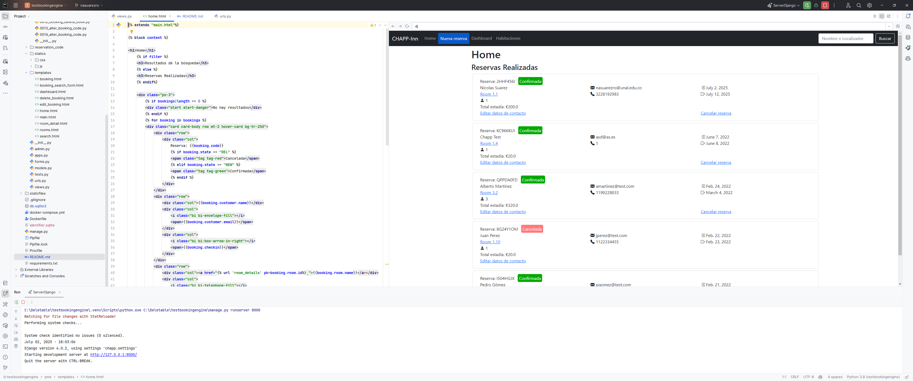

# PMS 

A small open-source PMS app made with Django.

## Stored data
- Type of rooms: name, n° of guests and price per day
- Rooms: name, description
- Customers: name, email, phone
- Bookings: checkin, checkout, total guests, customer information, total amount

## Features
- Create, delete and check bookings for each room
- Check room availability
- Find bookings by code or customer name
- Dashboard with bookings, incoming and outcoming customers, total invoiced
- Get detailed information about each room
- Edit customer information

## Local Deployment

To deploy this project locally run

### Using Docker
```bash
    docker compose -f docker-compose.yml up
```

### Using Virtualenv
> **Nota:** Este proyecto requiere Python 3.8
```bash
    pip install virtualenv
    virtualenv pms
    source pms/bin/activate
    pip install django
    git clone https://github.com/oscarchapp/testbookingengine
    cd chapp_pms
    pipenv sync
    python manage.py runserver
```

### Using Pycharm
1. Open the project in Pycharm
2. Create a new virtual environment
3. Install the requirements from `requirements.txt`
4. Configure the Django server in Pycharm
5. Run the server

#### If your configuration is correct, you should see the following screen:


### Django admin (/admin)
Use for username and password for superuser is "admin" (without quotes).Remember to change it.

### Warnings
- SECRET_KEY should be stored in .env file for production!
- DEBUG is set to TRUE.

## TODO List / Improvements

- Handle and create error pages
- Validate dates for checkin/checkout in serverside
- Check for room availability exactly before save data in DB
- Change date or define date range in dashboard
- Improve and add more data in dashboard


## License
[](https://choosealicense.com/licenses/mit/)


